# Analytics Guide

Analyze token pricing, graduation progress, and trade impact — offline or online.

<div align="center">
  
</div>

## Overview

The analytics module (`src/analytics.ts`) provides pure functions for market analysis. They work **offline** — no RPC calls needed — as long as you have the bonding curve state. The `OnlinePumpSdk` also wraps these with convenient online fetchers.

## Offline Functions

### Price Impact

Calculate how much a trade will move the price:

```typescript
import {
  calculateBuyPriceImpact,
  calculateSellPriceImpact,
} from "@pump-fun/pump-sdk";
import BN from "bn.js";

// Buy impact for 1 SOL
const buyImpact = calculateBuyPriceImpact({
  global,
  feeConfig,
  mintSupply: bondingCurve.tokenTotalSupply,
  bondingCurve,
  solAmount: new BN(1_000_000_000),
});

console.log(`Impact: ${buyImpact.impactBps} bps`);
console.log(`Tokens received: ${buyImpact.outputAmount.toString()}`);
console.log(`Price before: ${buyImpact.priceBefore.toString()} lamports/token`);
console.log(`Price after: ${buyImpact.priceAfter.toString()} lamports/token`);

// Sell impact for 1M tokens
const sellImpact = calculateSellPriceImpact({
  global,
  feeConfig,
  mintSupply: bondingCurve.tokenTotalSupply,
  bondingCurve,
  tokenAmount: new BN(1_000_000),
});

console.log(`Sell impact: ${sellImpact.impactBps} bps`);
console.log(`SOL received: ${sellImpact.outputAmount.toString()} lamports`);
```

### Graduation Progress

Check how close a token is to graduating from the bonding curve to an AMM pool:

```typescript
import { getGraduationProgress } from "@pump-fun/pump-sdk";

const progress = getGraduationProgress(bondingCurve);

console.log(`Progress: ${(progress.progressBps / 100).toFixed(1)}%`);
console.log(`Graduated: ${progress.isGraduated}`);
console.log(`Tokens remaining: ${progress.tokensRemaining.toString()}`);
console.log(`SOL accumulated: ${progress.solAccumulated.toString()} lamports`);
```

Graduation progress is measured in basis points (0–10,000 bps = 0–100%). When `isGraduated` is `true`, the token has completed its bonding curve and can be migrated to an AMM pool.

### Token Price

Get the current buy and sell price per whole token:

```typescript
import { getTokenPrice } from "@pump-fun/pump-sdk";

const price = getTokenPrice({
  global,
  feeConfig,
  bondingCurve,
});

console.log(`Buy price: ${price.buyPricePerToken.toString()} lamports/token`);
console.log(`Sell price: ${price.sellPricePerToken.toString()} lamports/token`);
console.log(`Market cap: ${price.marketCap.toNumber() / 1e9} SOL`);
```

A "whole token" is 10^6 raw units (the standard Pump token decimals).

### Bonding Curve Summary

Get a comprehensive snapshot of a bonding curve in a single call:

```typescript
import { getBondingCurveSummary } from "@pump-fun/pump-sdk";

const summary = getBondingCurveSummary({ global, feeConfig, bondingCurve });

console.log(`Market cap: ${summary.marketCap.toNumber() / 1e9} SOL`);
console.log(`Progress: ${(summary.progressBps / 100).toFixed(1)}%`);
console.log(`Buy price: ${summary.buyPricePerToken.toString()} lamports/token`);
console.log(`Sell price: ${summary.sellPricePerToken.toString()} lamports/token`);
console.log(`Graduated: ${summary.isGraduated}`);
console.log(`Real SOL reserves: ${summary.realSolReserves.toString()}`);
console.log(`Real token reserves: ${summary.realTokenReserves.toString()}`);
```

## Online Fetchers

The `OnlinePumpSdk` wraps each analytics function with state fetching, so you can go from mint address to result in one call:

```typescript
import { OnlinePumpSdk } from "@pump-fun/pump-sdk";
import BN from "bn.js";

const sdk = new OnlinePumpSdk(connection);
const mint = new PublicKey("your-token-mint");

// Full summary
const summary = await sdk.fetchBondingCurveSummary(mint);

// Graduation progress
const progress = await sdk.fetchGraduationProgress(mint);

// Token price
const price = await sdk.fetchTokenPrice(mint);

// Buy price impact (1 SOL)
const buyImpact = await sdk.fetchBuyPriceImpact(mint, new BN(1e9));

// Sell price impact (1M tokens)
const sellImpact = await sdk.fetchSellPriceImpact(mint, new BN(1_000_000));
```

### Additional Online Methods

```typescript
// Check if token graduated to AMM
const graduated = await sdk.isGraduated(mint);

// Get user's token balance
const balance = await sdk.getTokenBalance(mint, user);

// Sell all tokens and close ATA
const ixs = await sdk.sellAllInstructions({ mint, user, slippage: 1 });
```

## Types

### `PriceImpactResult`

```typescript
interface PriceImpactResult {
  priceBefore: BN;     // Price per token BEFORE the trade (lamports)
  priceAfter: BN;      // Price per token AFTER the trade (lamports)
  impactBps: number;   // Price impact in basis points (150 = 1.5%)
  outputAmount: BN;    // Tokens received (buy) or SOL received (sell)
}
```

### `GraduationProgress`

```typescript
interface GraduationProgress {
  progressBps: number;    // 0–10000 bps (0–100%)
  isGraduated: boolean;   // Whether already graduated
  tokensRemaining: BN;    // Tokens left before graduation
  tokensTotal: BN;        // Total real tokens the curve started with
  solAccumulated: BN;     // SOL in real reserves
}
```

### `TokenPriceInfo`

```typescript
interface TokenPriceInfo {
  buyPricePerToken: BN;    // Cost to buy 1 whole token (lamports)
  sellPricePerToken: BN;   // SOL received for selling 1 whole token
  marketCap: BN;           // Current market cap (lamports)
  isGraduated: boolean;    // Whether the curve is complete
}
```

### `BondingCurveSummary`

```typescript
interface BondingCurveSummary {
  marketCap: BN;
  progressBps: number;
  isGraduated: boolean;
  buyPricePerToken: BN;
  sellPricePerToken: BN;
  realSolReserves: BN;
  realTokenReserves: BN;
  virtualSolReserves: BN;
  virtualTokenReserves: BN;
}
```

## See Also

- [API Reference — Analytics Functions](api-reference.md#analytics-functions) — Full parameter documentation
- [Bonding Curve Math](bonding-curve-math.md) — How virtual reserves and pricing work
- [Examples](examples.md#analytics--price-impact) — More code examples
