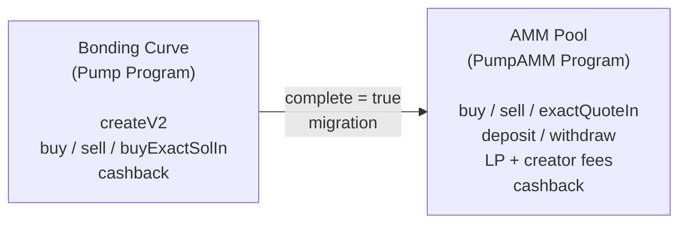

# Architecture

> How the SDK is organized: the offline/online split, the four on-chain programs, PDA derivation, the fee system, and the companion components in this repository.

## Repository Structure

Beyond the core SDK (`src/`), the repository includes several companion components:

| Directory | Purpose |
|-----------|---------|
| `src/` | Core SDK: instruction builders, bonding curve math, fees, PDAs, state, events, analytics, vanity mint, RPC fallback |
| `examples/` | 50 numbered runnable examples (`npm run example NN`) |
| `rust/` | High-performance Rust vanity address generator (rayon + solana-sdk) |
| `typescript/` | TypeScript vanity address generator (@solana/web3.js) |
| `mcp-server/` | Model Context Protocol server for AI agent integration |
| `telegram-bot/` | PumpFun activity monitor: Telegram bot + REST API (claims, CTO, launches, graduation, whales, fee distribution) |
| `websocket-server/` | WebSocket relay: PumpFun API to browser clients |
| `x402/` | x402 payment protocol: HTTP 402 micropayments with Solana USDC |
| `live/` | Standalone live dashboards: token launches + trades analytics |
| `website/` | PumpOS web desktop |
| `tutorials/` | Hands-on tutorial guides |
| `scripts/` | Production Bash scripts wrapping solana-keygen |
| `tests/` | Cross-language test suites |
| `docs/` | API reference, architecture, guides |
| `security/` | Security audits and checklists |
| `skills/` | Agent skill documents |
| `prompts/` | Agent prompt templates |
| `tools/` | Audit & verification scripts (dependencies, permissions, keypairs) |
| `lair-tg/` | Lair: unified Telegram bot platform for DeFi intelligence |
| `.well-known/` | AI plugin manifest, agent config, skills registry, security.txt |
| `packages/defi-agents/` | AI agent definitions for DeFi workflows |
| `packages/plugin.delivery/` | AI plugin index for SperaxOS function-call plugins |

## Core SDK Module Map

```
src/
├── index.ts              # Public API barrel: re-exports everything
├── sdk.ts                # PumpSdk: instruction builders, account decoders, event decoders
├── onlineSdk.ts          # OnlinePumpSdk: fetchers, quotes, routed trading, BothPrograms aggregators
├── bondingCurve.ts       # Pure math for price quoting + sell overflow guards
├── analytics.ts          # Price impact, graduation progress, token price, curve summary
├── fees.ts               # Fee tier calculation + breaking-fee-recipient helpers
├── errors.ts             # Custom error classes
├── pda.ts                # PDA derivation helpers (incl. socialFeePda, mayhem PDAs)
├── state.ts              # TypeScript types for on-chain accounts & events
├── tokenIncentives.ts    # Volume-based reward calculations
├── vanityMint.ts         # In-process vanity mint grinding
├── fallback.ts           # RPC failover Connection + HTTP fetch fallback
├── programIds.ts         # The four program IDs
└── idl/
    ├── pump.ts / pump.json           # Pump program IDL
    ├── pump_amm.ts / pump_amm.json   # PumpAMM program IDL
    └── pump_fees.ts / pump_fees.json # PumpFees program IDL
```

## Core Concepts

### Offline / Online Split

The SDK is split into two layers:

| Layer | Class | Needs Connection? | Use Case |
|-------|-------|-------------------|----------|
| Offline | `PumpSdk` | No | Instruction building, decoding accounts and events, pure computation |
| Online | `OnlinePumpSdk` | Yes | Fetching on-chain state, quotes, routed trading, simulations |

**`PumpSdk`** uses a null Anchor provider internally, so it can construct any instruction without touching the network. A pre-built singleton is exported as `PUMP_SDK`; use it instead of constructing your own.

**`OnlinePumpSdk`** wraps `PUMP_SDK` with a real `Connection`, adding fetchers (`fetchGlobal()`, `fetchBuyState()`, ...), quote methods (`quoteBuy`, `quoteSell`, `ammQuoteBuy`, `ammQuoteSell`), and high-level trading conveniences (`buyBySolAmount`, `sellByPercentage`, `sellChunked`, `routedBuyInstructions`). `OnlinePumpSdk.withFallback([...endpoints])` builds one on top of an auto-failover connection (see `src/fallback.ts`).

### Four Solana Programs

The SDK interacts with four on-chain programs:

| Program | ID | Purpose |
|---------|----|---------|
| **Pump** | `6EF8rrecthR5Dkzon8Nwu78hRvfCKubJ14M5uBEwF6P` | Token creation, bonding curve buy/sell, cashback |
| **PumpAMM** | `pAMMBay6oceH9fJKBRHGP5D4bD4sWpmSwMn52FMfXEA` | AMM pool trading, liquidity, graduated token fees |
| **PumpFees** | `pfeeUxB6jkeY1Hxd7CsFCAjcbHA9rWtchMGdZ6VojVZ` | Fee sharing, social fees, authority management |
| **Mayhem** | `MAyhSmzXzV1pTf7LsNkrNwkWKTo4ougAJ1PPg47MD4e` | Alternate routing and fee recipients |

### Token Lifecycle



1. **Creation**: a new token is created with `createV2Instruction`. It starts on a bonding curve and can permanently route creator fees to holders. New cashback launches are deprecated.
2. **Trading**: users buy and sell via `buyInstructions` / `sellInstructions` / `buyExactSolInInstruction`. Prices follow the bonding curve math.
3. **Graduation**: when `bondingCurve.complete` becomes `true`, the token graduates.
4. **Migration**: `migrateInstruction` moves the token to the canonical AMM pool derived by `canonicalPumpPoolPda(mint)`.
5. **AMM Trading**: post-graduation trading via `ammBuyInstruction` / `ammSellInstruction` / `ammBuyExactQuoteInInstruction` (or the online wrappers, which route automatically).
6. **AMM Liquidity**: LPs deposit/withdraw via `ammDepositInstruction` / `ammWithdrawInstruction`.
7. **Rewards**: cashback (`claimCashbackInstruction`, `ammClaimCashbackInstruction`), volume-based token incentives, and social fee PDAs.

### 2026-04-28 Breaking Fee Recipient Upgrade

Since the 2026-04-28 program upgrade, every bonding curve buy/sell instruction must carry one of 8 designated fee recipient accounts as a mutable trailing account, and every AMM buy/sell must carry that recipient plus its WSOL ATA. All `PUMP_SDK` and `OnlinePumpSdk` builders handle this automatically. For hand-rolled instructions the SDK exports `pickBreakingFeeRecipient`, `buildAmmBreakingFeeRecipientAccounts`, `validateBcInstruction` / `validateAmmInstruction`, and `patchBcInstruction` / `patchAmmInstruction`. Canonical spec: `docs/pump-public-docs/BREAKING_FEE_RECIPIENT.md`.

### PDA Derivation

All Program Derived Addresses are computed deterministically in `pda.ts`. Key PDAs:

| PDA | Derivation | Description |
|-----|-----------|-------------|
| `bondingCurvePda(mint)` | Seeds from Pump program | Token's bonding curve account |
| `creatorVaultPda(creator)` | Seeds from Pump program | Creator fee vault |
| `ammCreatorVaultPda(creator)` | Seeds from AMM program | Creator fee vault (AMM side) |
| `canonicalPumpPoolPda(mint)` | Pool index `0` | The main AMM pool for a graduated token |
| `feeSharingConfigPda(mint)` | Seeds from fee program | Fee sharing configuration |
| `socialFeePda(userId, platform)` | Seeds from fee program | Social fee PDA for platform-based collection |
| `userVolumeAccumulatorPda(user)` | Seeds from Pump program | User's trading volume tracker |
| `GLOBAL_PDA` | Constant | Global configuration account |
| `AMM_GLOBAL_PDA` | Constant | AMM global configuration |

### Fee System

Fees are calculated based on market cap tiers:

```typescript
interface FeeConfig {
  admin: PublicKey;
  flatFees: Fees;        // Default rates
  feeTiers: FeeTier[];   // Market-cap-dependent tiers
}

interface FeeTier {
  marketCapLamportsThreshold: BN;
  fees: Fees;            // { lpFeeBps, protocolFeeBps, creatorFeeBps }
}
```

The `computeFeesBps()` function in `fees.ts` selects the appropriate tier based on the token's current market cap. Fee amounts are in basis points (1 bps = 0.01%). See [Fee Tiers](./fee-tiers.md).

### Mayhem Mode

An alternate operating mode that:
- Uses `reservedFeeRecipient` and `reservedFeeRecipients` from the `Global` account
- Routes through the Mayhem program (`MAyhSmzXzV1pTf7LsNkrNwkWKTo4ougAJ1PPg47MD4e`) for token vaults
- Is activated per-token at creation time via `createV2Instruction({ mayhemMode: true })`
- Uses the token's real mint supply (instead of the fixed 1B constant) in fee tier market-cap calculations

### BothPrograms Pattern

Many `OnlinePumpSdk` methods have a `*BothPrograms` variant:

```typescript
// Pump program only
await sdk.getCreatorVaultBalance(creator);

// Pump + AMM combined
await sdk.getCreatorVaultBalanceBothPrograms(creator);
```

This pattern appears for creator vault balances, token incentive claims, volume accumulator syncs, unclaimed token queries, and cashback claims. It ensures correct behavior regardless of whether a token has graduated to the AMM.

### Analytics Module

The `analytics.ts` module provides pure offline functions for market analysis without RPC calls:

| Function | Purpose |
|----------|---------|
| `calculateBuyPriceImpact()` | Price slippage for a buy trade (in bps) |
| `calculateSellPriceImpact()` | Price slippage for a sell trade (in bps) |
| `getGraduationProgress()` | How close a token is to graduating (0-10000 bps) plus SOL needed |
| `bondingCurveGraduationProgress()` | Lightweight 0-1 progress, no `Global` needed |
| `getTokenPrice()` | Buy/sell price per whole token + market cap |
| `getBondingCurveSummary()` | All-in-one: market cap, progress, pricing, reserves, current fee tier |

These are also wrapped by `OnlinePumpSdk` as `fetchBondingCurveSummary()`, `fetchGraduationProgress()`, `fetchTokenPrice()`, `fetchBuyPriceImpact()`, and `fetchSellPriceImpact()`, which handle state fetching automatically.

See the [Analytics Guide](analytics.md) for usage examples.

### Social Fee PDAs

The SDK supports social fee PDAs for platform-based fee collection. These route fees to users identified by a `userId` and a `Platform` enum value rather than a Solana public key. Only `Platform.GitHub` is currently supported (`SUPPORTED_SOCIAL_PLATFORMS`), and the `userId` is the numeric GitHub user id as a string:

```typescript
import { PUMP_SDK, Platform } from "@nirholas/pump-sdk";

// Create a social fee PDA
const ix = await PUMP_SDK.createSocialFeePdaInstruction({
  payer: wallet.publicKey,
  userId: "583231",             // GitHub numeric user id
  platform: Platform.GitHub,
});

// Claim from a social fee PDA (requires the social claim authority)
const ix2 = await PUMP_SDK.claimSocialFeePdaInstruction({
  recipient: wallet.publicKey,
  socialClaimAuthority,
  userId: "583231",
  platform: Platform.GitHub,
});

// Fetch social fee PDA state (online)
const state = await sdk.fetchSocialFeePda("583231", Platform.GitHub);
```

### Event Types

The SDK exports typed event structures for all on-chain Anchor events:

| Category | Events |
|----------|--------|
| **Trading** | `TradeEvent`, `AmmBuyEvent`, `AmmSellEvent` |
| **Lifecycle** | `CreateEvent`, `CompleteEvent`, `CompletePumpAmmMigrationEvent` |
| **Fees** | `CollectCreatorFeeEvent`, `ClaimCashbackEvent`, `DistributeCreatorFeesEvent` |
| **Fee Sharing** | `CreateFeeSharingConfigEvent`, `UpdateFeeSharesEvent`, `ResetFeeSharingConfigEvent`, `RevokeFeeSharingAuthorityEvent`, `TransferFeeSharingAuthorityEvent` |
| **Social Fees** | `SocialFeePdaCreatedEvent`, `SocialFeePdaClaimedEvent` |
| **Volume** | `ClaimTokenIncentivesEvent`, `InitUserVolumeAccumulatorEvent`, `SyncUserVolumeAccumulatorEvent`, `CloseUserVolumeAccumulatorEvent` |
| **Pools** | `CreatePoolEvent`, `DepositEvent`, `WithdrawEvent` |
| **Admin** | `AdminSetCreatorEvent`, `SetCreatorEvent`, `MigrateBondingCurveCreatorEvent`, `ExtendAccountEvent` |

`OnlinePumpSdk.parseTransactionEvents(signature)` decodes all of them from a confirmed transaction into the `PumpEvent` discriminated union. See [Events Reference](./events-reference.md).

### WebSocket Relay Server

The `websocket-server/` directory contains a Node.js WebSocket relay that bridges between PumpFun's API and browser clients:

```
PumpFun API <-- SolanaMonitor --> Relay Server (:3099/ws) --> Browsers
  (5s poll)                         HTTP + WS            cards w/ images
```

**Data flow:**
1. `SolanaMonitor` polls `frontend-api-v3.pump.fun/coins` every 5 seconds for latest token launches
2. New tokens are deduplicated by mint address and enriched with name, symbol, image, socials, market cap
3. `Relay Server` broadcasts structured `token-launch` events to all connected WebSocket clients
4. Built-in dashboard at `/` renders token cards with images, links, and descriptions
5. Health check at `/health` returns connection status, client count, and uptime

Also maintains a Solana RPC WebSocket subscription as a supplementary data source when available.

### MCP Server

The `mcp-server/` directory exposes the SDK as Model Context Protocol tools (67 tools at last count) so AI assistants (Claude, Copilot, custom agents) can quote, build transactions, manage fees, and run analytics. See `mcp-server/README.md` for setup.

## Design Principles

1. **Instruction-first**: methods return `TransactionInstruction` arrays. The caller decides how to batch, sign, and submit transactions.
2. **No wallet binding**: the SDK never signs transactions. Signing is the caller's responsibility.
3. **Deterministic PDAs**: all account addresses are derivable from mint and user public keys.
4. **Backward compatibility**: v1 methods (`createInstruction`, `createAndBuyInstructions`) are kept but deprecated in favor of v2.
5. **Type safety**: full TypeScript types for all on-chain account structures via Anchor IDL types.
6. **Fail before the chain does**: pre-flight validation (`validateSellAmount`, shareholder checks) turns on-chain aborts into typed SDK errors thrown before any transaction is broadcast.

## Related

- [API Reference](./api-reference.md): the full export surface
- [Bonding Curve Math](./bonding-curve-math.md) and [Fee Tiers](./fee-tiers.md)
- [End-to-End Workflow](./end-to-end-workflow.md): the lifecycle in code

Runnable examples: `examples/` covers every layer described here; run any with `npm run example NN`.
