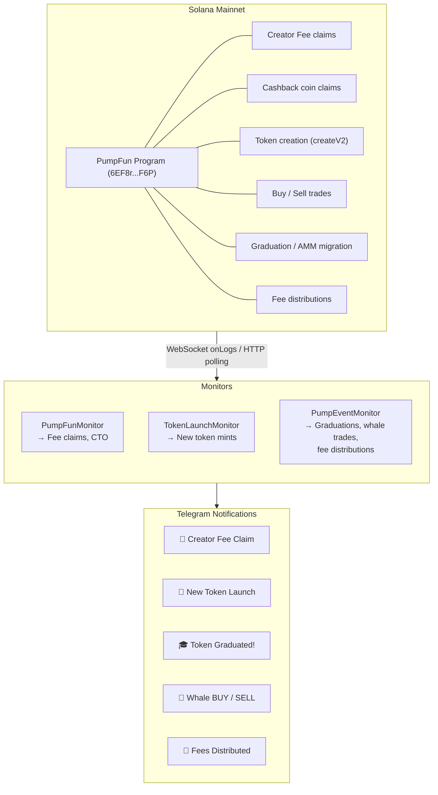

# PumpFun Fee Claim Monitor

Telegram bot + REST API that monitors **PumpFun** on Solana and sends real-time notifications when **Creator Fees**, **Cashback Rewards**, **Creator Takeovers (CTO)**, **Token Graduations**, **Whale Trades**, or **Fee Distributions** are detected. Also monitors new token launches with cashback coin detection.

Works in personal DMs, group chats, and as a standalone API.

## Features

- **Watch wallets** — Track any fee-recipient Solana wallet
- **Creator Fees + Cashback Coins** — Detects both claim types
- **CTO (Creator Takeover) alerts** — Detects creator fee redirection events
- **Token launch monitor** — Real-time detection of new PumpFun token mints with cashback coin flag
- **🎓 Graduation alerts** — Notifies when a token completes its bonding curve or migrates to PumpAMM
- **🐋 Whale trade alerts** — Configurable SOL threshold for large buy/sell notifications with bonding curve progress bar
- **💎 Fee distribution alerts** — Tracks creator fee distributions to shareholders with share breakdown
- **REST API** — Scalable HTTP API with auth, rate limiting, SSE streaming, and webhooks
- **Real-time** — WebSocket mode for instant alerts (or HTTP polling fallback)
- **Group-ready** — Add to Telegram groups so your whole team gets notified
- **Persistent watches** — Saved to disk, survives restarts
- **Links** — Every notification includes Solscan TX link, wallet link, and pump.fun token link

## Quick Start

### 1. Create a Telegram bot

1. Open [@BotFather](https://t.me/BotFather) on Telegram
2. Send `/newbot` and follow the prompts
3. Copy the bot token

### 2. Configure

```bash
cp .env.example .env
```

Edit `.env`:

```env
TELEGRAM_BOT_TOKEN=your_bot_token_here
SOLANA_RPC_URL=https://api.mainnet-beta.solana.com

# Optional: restrict to specific Telegram user IDs (comma-separated)
ALLOWED_USER_IDS=123456789

# Optional: use a dedicated RPC with WebSocket support for real-time monitoring
# SOLANA_WS_URL=wss://atlas-mainnet.helius-rpc.com/?api-key=YOUR_KEY
```

> **Recommended:** Use a paid RPC provider (Helius, QuickNode, Triton) for reliable WebSocket connections and higher rate limits. The free Solana mainnet RPC can rate-limit you.

### 3. Install & Run

```bash
npm install
npm run dev      # Development (hot reload with tsx)
```

For production:

```bash
npm run build
npm start
```

## Bot Commands

| Command | Description |
|---------|-------------|
| `/start` | Welcome message |
| `/help` | Show all commands |
| `/watch <wallet> [label]` | Watch a fee-recipient wallet for claims |
| `/unwatch <wallet_or_#>` | Stop watching (by address or list number) |
| `/list` | Show all active watches for this chat |
| `/status` | Monitor status, uptime, claims detected |
| `/monitor` | Start real-time new token launch monitoring |
| `/stopmonitor` | Stop token launch monitoring |

## How It Works



### Detection Strategies

The monitor uses three layered strategies to catch fee claims:

1. **Instruction discriminator matching** — Checks the first 8 bytes of PumpFun instruction data against known `claimCreatorFees` and `claimCashback` discriminators
2. **Inner instruction SOL transfers** — Detects SOL moving from PumpFun-owned accounts to external wallets via CPI
3. **Balance-change heuristic** — As a fallback, identifies accounts that gained SOL when PumpFun was invoked

## Example Notification

```
🏦 Creator Fee Claim Detected!

👤 Claimer: HN7c...4xYz (MyProject)
💰 Amount: 2.5000 SOL
🔗 Token Mint: pump...Dfn
🕐 Time: 2026-02-26 14:30:00 UTC

🔗 View TX · Wallet · pump.fun
```

For Cashback Coins:

```
💸 Cashback Claim Detected!

👤 Claimer: 9kBf...3mNp (Trader)
💰 Amount: 0.1500 SOL
🔗 Token Mint: cash...xyz
🕐 Time: 2026-02-26 14:32:00 UTC

🔗 View TX · Wallet · pump.fun
```

### Graduation Alert

```
🎓 Token Graduated!

🔗 Mint: pump...Dfn
👤 Triggered by: HN7c...4xYz
📈 Type: AMM Migration
💰 SOL Migrated: 85.00 SOL
🏊 Migration Fee: 0.5000 SOL
🔗 AMM Pool: pAMM...9kBf
🕐 Time: 2026-02-26 15:00:00 UTC

🔗 View TX · Solscan · pump.fun
```

### Whale Trade Alert

```
🐋 Whale BUY!

🟢 Amount: 50.00 SOL
🪙 Token: pump...Dfn
👤 Trader: 9kBf...3mNp
💹 Market Cap: ~420.5 SOL
📊 Graduation: [████████░░] 82.3%
💰 Fee: 0.5000 SOL | Creator Fee: 0.2500 SOL
🕐 Time: 2026-02-26 15:05:00 UTC

🔗 View TX · Solscan · pump.fun
```

### Fee Distribution Alert

```
💎 Creator Fees Distributed!

🪙 Token: pump...Dfn
💰 Distributed: 1.2500 SOL
👤 Admin: HN7c...4xYz
👥 Shareholders (3):
  • 9kBf...3mNp — 50.0%
  • Abcd...eF12 — 30.0%
  • Ghij...kL34 — 20.0%

🕐 Time: 2026-02-26 15:10:00 UTC

🔗 View TX · Solscan · pump.fun
```

## Project Structure

```
pumpfun-telegram-bot/
├── package.json
├── tsconfig.json
├── .env.example
├── .gitignore
├── README.md
├── data/                  # Persisted watch data (auto-created)
│   ├── watches.json       # Telegram bot watches
│   └── api-watches.json   # API watches
└── src/
    ├── index.ts           # Entry point — wires bot + API + event monitor together
    ├── config.ts          # Environment variable loading
    ├── types.ts           # All type definitions & PumpFun constants
    ├── logger.ts          # Simple leveled logger
    ├── store.ts           # In-memory + disk-persisted watch store (bot)
    ├── monitor.ts         # Solana RPC monitor for PumpFun fee claims
    ├── token-launch-monitor.ts  # Real-time new token launch detection
    ├── pump-event-monitor.ts    # Graduation, whale trade & fee distribution monitor
    ├── launch-store.ts    # Per-chat launch monitor state
    ├── bot.ts             # grammу Telegram bot & command handlers
    ├── formatters.ts      # Rich HTML message formatting
    └── api/               # Scalable REST API
        ├── index.ts       # Module barrel
        ├── server.ts      # HTTP server, routing, auth, CORS, OpenAPI
        ├── types.ts       # API request/response types
        ├── apiStore.ts    # Per-client watch CRUD (separate from bot)
        ├── claimBuffer.ts # Ring buffer + SSE fan-out for claims
        ├── rateLimiter.ts # Sliding-window per-client rate limiter
        └── webhooks.ts    # Webhook delivery with HMAC signatures + retries
```

## REST API

The bot includes a scalable REST API for programmatic access to the fee claim monitoring system. Enable it alongside the Telegram bot or run it standalone.

### Quick Start (API)

```bash
# API-only mode (no Telegram bot)
npm run api

# Bot + API together
npm run dev:full

# Production
ENABLE_API=true npm run build && ENABLE_API=true npm start
```

### Authentication

Set `API_KEYS` in `.env` to require API key authentication:

```env
API_KEYS=sk_live_abc123,sk_live_def456
```

Pass your key via header:

```bash
# X-API-Key header
curl -H "X-API-Key: sk_live_abc123" http://localhost:3000/api/v1/status

# Or Authorization Bearer
curl -H "Authorization: Bearer sk_live_abc123" http://localhost:3000/api/v1/status
```

If `API_KEYS` is empty, no authentication is required (development mode).

### API Endpoints

| Method | Path | Auth | Description |
|--------|------|------|-------------|
| `GET` | `/api/v1/health` | No | Health check, uptime, monitor status |
| `GET` | `/api/v1/openapi` | No | OpenAPI 3.0.3 spec (JSON) |
| `GET` | `/api/v1/status` | Yes | Detailed monitor + watch + claim stats |
| `GET` | `/api/v1/claims` | Yes | Paginated claim history with filters |
| `GET` | `/api/v1/claims/stream` | Yes | SSE real-time claim event stream |
| `GET` | `/api/v1/watches` | Yes | List your watches (paginated) |
| `POST` | `/api/v1/watches` | Yes | Create a new watch |
| `GET` | `/api/v1/watches/:id` | Yes | Get a specific watch |
| `PATCH` | `/api/v1/watches/:id` | Yes | Update a watch |
| `DELETE` | `/api/v1/watches/:id` | Yes | Delete a watch |

### Create a Watch

```bash
curl -X POST http://localhost:3000/api/v1/watches \
  -H "X-API-Key: sk_live_abc123" \
  -H "Content-Type: application/json" \
  -d '{
    "wallet": "HN7c...4xYz",
    "label": "MyProject",
    "webhookUrl": "https://example.com/webhook"
  }'
```

Response:

```json
{
  "id": "aw_1740700000001",
  "wallet": "HN7c...4xYz",
  "label": "MyProject",
  "active": true,
  "webhookUrl": "https://example.com/webhook",
  "createdAt": "2026-02-27T12:00:00.000Z",
  "clientId": "client_abc"
}
```

### Query Claims

```bash
# All claims (paginated)
curl "http://localhost:3000/api/v1/claims?page=1&limit=20" -H "X-API-Key: ..."

# Filter by wallet
curl "http://localhost:3000/api/v1/claims?wallet=HN7c...4xYz" -H "X-API-Key: ..."

# Filter by type and amount
curl "http://localhost:3000/api/v1/claims?isCashback=false&minAmountSol=1.0" -H "X-API-Key: ..."

# Filter by date range
curl "http://localhost:3000/api/v1/claims?since=2026-02-01&until=2026-02-28" -H "X-API-Key: ..."
```

### Real-Time SSE Stream

```bash
# Stream all claims
curl -N "http://localhost:3000/api/v1/claims/stream" -H "X-API-Key: ..."

# Stream filtered by wallet
curl -N "http://localhost:3000/api/v1/claims/stream?wallet=HN7c...4xYz" -H "X-API-Key: ..."
```

Events:

```
event: connected
data: {"clientId":"client_abc","timestamp":"2026-02-27T12:00:00.000Z"}

event: claim
data: {"txSignature":"5xK...","claimerWallet":"HN7c...","amountSol":2.5,"claimType":"collect_creator_fee",...}
```

### Webhooks

When creating a watch with a `webhookUrl`, the API will POST claim events to that URL with exponential backoff retries (up to 3 attempts).

**HMAC Signature Verification:** If `WEBHOOK_SECRET` is set, every webhook includes an `X-PumpFun-Signature` header containing `sha256=<hex>`. Verify it on your server:

```javascript
const crypto = require('crypto');

function verifyWebhook(body, signature, secret) {
  const expected = 'sha256=' + crypto
    .createHmac('sha256', secret)
    .update(body)
    .digest('hex');
  return crypto.timingSafeEqual(Buffer.from(signature), Buffer.from(expected));
}
```

Webhook headers:
- `X-PumpFun-Event: claim.detected`
- `X-PumpFun-Timestamp: <unix_ms>`
- `X-PumpFun-Signature: sha256=<hex>` (when `WEBHOOK_SECRET` is set)

Payload:

```json
{
  "event": "claim.detected",
  "data": {
    "txSignature": "5xK...",
    "claimerWallet": "HN7c...4xYz",
    "amountSol": 2.5,
    "claimType": "collect_creator_fee",
    "tokenMint": "pump...Dfn",
    "timestamp": "2026-02-27T14:30:00.000Z"
  },
  "watchIds": ["aw_1740700000001"],
  "timestamp": "2026-02-27T14:30:01.000Z"
}
```

### Rate Limiting

All authenticated endpoints are rate-limited per API key:

| Header | Description |
|--------|-------------|
| `X-RateLimit-Limit` | Max requests per window |
| `X-RateLimit-Remaining` | Requests remaining |
| `X-RateLimit-Reset` | Seconds until window resets |
| `Retry-After` | Seconds to wait (only on 429) |

Default: 100 requests per 60-second window. Configure via `RATE_LIMIT_MAX` and `RATE_LIMIT_WINDOW_MS`.

### Scaling

The API is designed for horizontal scaling:

| Component | Single Instance | Multi-Instance |
|-----------|----------------|----------------|
| Rate limiter | In-memory Map | Swap for Redis |
| Watch store | JSON file | Swap for PostgreSQL/Redis |
| Claim buffer | In-memory ring buffer | Swap for Redis Streams |
| SSE fan-out | In-process subscribers | Add Redis pub/sub |
| Webhooks | Fire-and-forget with retry | Add job queue (BullMQ) |


## Environment Variables

| Variable | Required | Default | Description |
|----------|----------|---------|-------------|
| `TELEGRAM_BOT_TOKEN` | ✅* | — | Bot token from @BotFather (*not needed in API-only mode) |
| `SOLANA_RPC_URL` | — | `https://api.mainnet-beta.solana.com` | Solana RPC endpoint |
| `SOLANA_WS_URL` | — | Derived from RPC URL | WebSocket endpoint for real-time |
| `POLL_INTERVAL_SECONDS` | — | `15` | Polling interval (when WS unavailable) |
| `ALLOWED_USER_IDS` | — | (allow all) | Comma-separated Telegram user IDs |
| `LOG_LEVEL` | — | `info` | `debug`, `info`, `warn`, `error` |
| `ENABLE_LAUNCH_MONITOR` | — | `false` | Enable new token launch monitoring |
| `GITHUB_ONLY_FILTER` | — | `false` | Only notify for tokens with GitHub links |
| `IPFS_GATEWAY` | — | `https://cf-ipfs.com/ipfs/` | IPFS gateway for metadata fetching |
| `ENABLE_GRADUATION_ALERTS` | — | `true` | Enable token graduation/migration alerts |
| `ENABLE_TRADE_ALERTS` | — | `false` | Enable whale trade alerts |
| `WHALE_THRESHOLD_SOL` | — | `10` | Minimum SOL for whale trade notifications |
| `ENABLE_FEE_DISTRIBUTION_ALERTS` | — | `false` | Enable creator fee distribution alerts |
| `ENABLE_API` | — | `false` | Enable the REST API server |
| `API_ONLY` | — | `false` | Run API without Telegram bot |
| `API_PORT` | — | `3000` | HTTP port for the API server |
| `API_KEYS` | — | (no auth) | Comma-separated API keys for auth |
| `WEBHOOK_SECRET` | — | (none) | HMAC-SHA256 secret for signing webhook payloads |
| `CORS_ORIGINS` | — | `*` | Allowed CORS origins |
| `MAX_WATCHES_PER_CLIENT` | — | `100` | Max watches per API key |
| `RATE_LIMIT_MAX` | — | `100` | Requests per rate limit window |
| `RATE_LIMIT_WINDOW_MS` | — | `60000` | Rate limit window in ms |
| `CLAIM_BUFFER_SIZE` | — | `10000` | Max claims buffered in memory |

## Adding to a Group Chat

1. Add your bot to the Telegram group
2. Anyone in the group can use `/watch` to add wallets
3. All group members will see claim notifications
4. Use `ALLOWED_USER_IDS` to restrict who can manage watches

## Tech Stack

- **[grammY](https://grammy.dev/)** — Telegram Bot framework for TypeScript
- **[@solana/web3.js](https://solana-labs.github.io/solana-web3.js/)** — Solana RPC client
- **TypeScript** — Full type safety
- **tsx** — Fast dev mode with hot reload

## License

MIT
